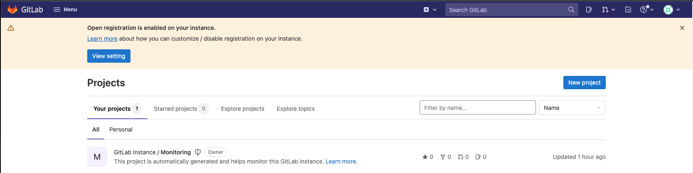
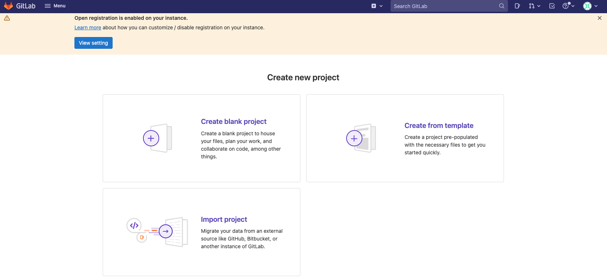
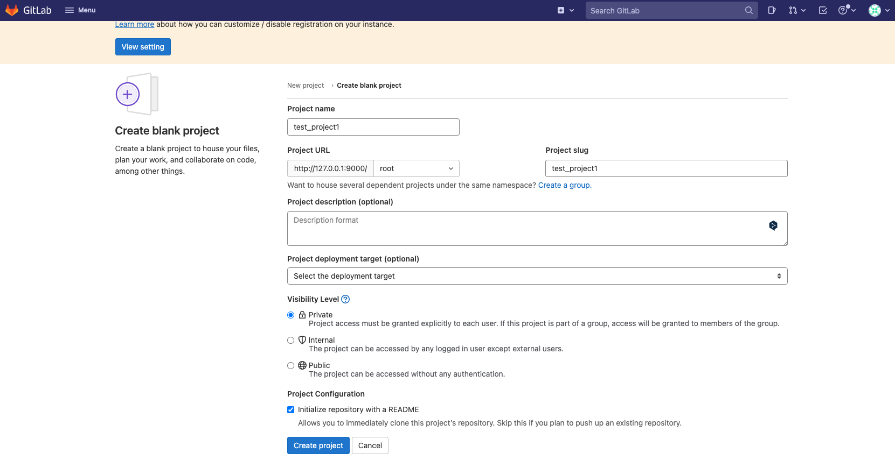
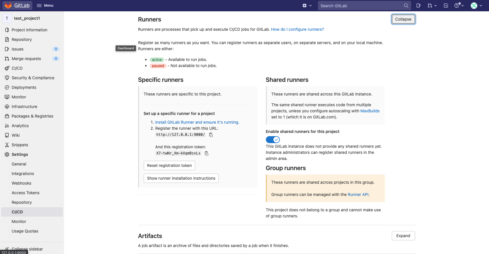
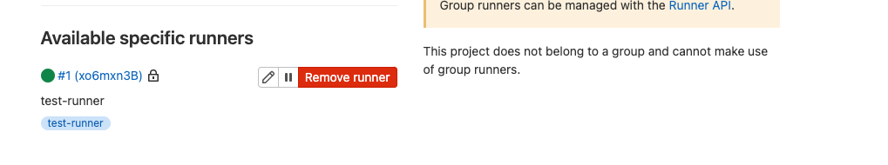

# docker を利用した gitlab/gitlab-runner 環境の準備

## 目的

docker で gitlab/gitlab-runner を準備

## ディレクトリ構成

- gitlab と gitlab-runner で`docker-compose.yml`は別々で用意する
- 各々のコンテナで設定関連のフォルダをローカルマウントする

```bash
.
├── README.md
├── gitlab
│   ├── docker-compose.yml
│   └── gitlab
└── gitlab-runner
    ├── docker-compose.yml
    └── gitlab-runner
```

## 手順

1. コンテナを立ち上げる

   `./gitlab`と`./gitlab-runner`のそれぞれで`docker-compose`を実行する

   ```bash
   docker-compose up -d
   ```

   `-d`はバックグランドで実行させるオプション。
   docker-sompose の実行ログを確認したい場合は下記を実行する

   ```bash
   docker-compose logs
   ```

1. gitlab へログインする

   1. ブラウザで `127.0.0.1:9000`にアクセスする

      

   1. Administrator でログインする

      | Username | Password |
      | -------- | -------- |
      | root     | 後述     |

      password は`./gitlab`で下記を実行することにより取得する

      ```bash
      docker compose exec gitlab cat /etc/gitlab/initial_root_password
      ```

1. プロジェクトを作成する

   1. 「New Project」をクリック
      

   1. 「Create blank project」をクリック
      

   1. 適当な情報を入力し、プロジェクトを作成する
      

1. トークンを取得する

   Serrings > CI/CD > Runners で Expand をクリック
   

1. gitlab-runner 側で、gitlab のトークン（1 つ前で払い出したもの）を登録する

   1. `./gitlab-runner`で下記を実行し、コンテナに入る

      ```bash
      docker compose exec gitlab-runner /bin/bash
      ```

   1. トークンと URL の登録

      ```bash
      root@gitlab-runner:/# gitlab-runner register
      Runtime platform                                    arch=amd64 os=linux pid=31 revision=565b6c0b version=14.8.0
      Running in system-mode.

      Enter the GitLab instance URL (for example, https://gitlab.com/):
      http://xxx.xxx.xxx.xxx:9000/ # <- localhost, 127.0.0.1は不可
      Enter the registration token:
      XXXXXXXXXXXXXXXXXXXX # <- 全手順で払い出したトークン
      Enter a description for the runner:
      [gitlab-runner]: test-runner
      Enter tags for the runner (comma-separated):
      test-runner
      Enter optional maintenance note for the runner:

      Registering runner... succeeded                     runner=RKAutDws
      Enter an executor: kubernetes, docker, shell, ssh, virtualbox, docker+machine, docker-ssh+machine, custom, docker-ssh, parallels:
      docker  # <- dockerを選択
      Enter the default Docker image (for example, ruby:2.7):
      python:3.10 # <- とりあえずpython
      Runner registered successfully. Feel free to start it, but if it's running already the config should be automatically reloaded!
      ```

   1. gitlab 側で登録の確認

1. `gitlab-ci.yml`を作成する

   settings > CI/CD > runner 　から確認する
   

1. ユーザーを登録する

   
   トップ画面から「Register now」をクリック

   
   情報を適当に入力し、ユーザーを作成する

   Admininistrator でユーザー作成を承認する
