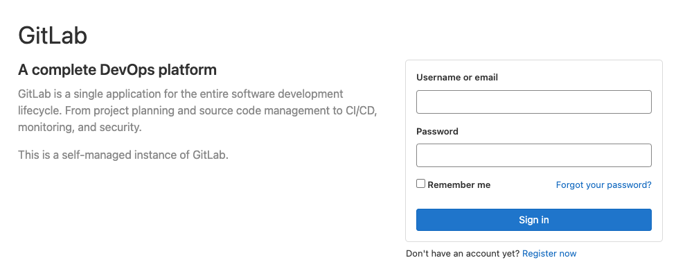
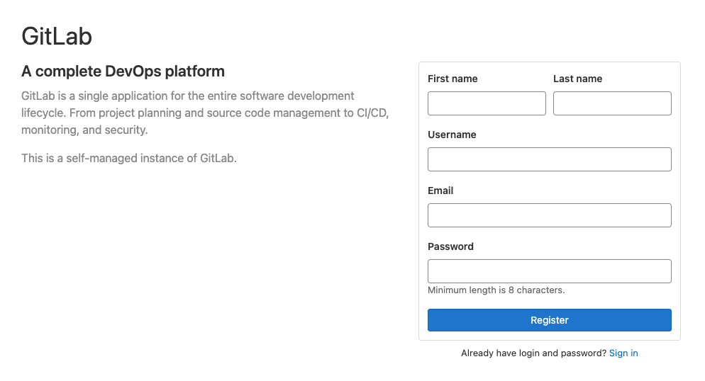

# docker-gitlab

## 目的

docker で gitlab/gitlab-runner を準備

## ディレクトリ構成

- gitlab と gitlab-runner で`docker-compose.yml`は別々で用意する
- 各々のコンテナで設定関連のフォルダをローカルマウントする

```bash
.
├── README.md
├── gitlab
│   ├── docker-compose.yml
│   └── gitlab
└── gitlab-runner
    ├── docker-compose.yml
    └── gitlab-runner
```

## 手順

1. コンテナを立ち上げる

   `./gitlab`と`./gitlab-runner`のそれぞれで`docker-compose`を実行する

   ```bash
   docker-compose up -d
   ```

   `-d`はバックグランドで実行させるオプション。
   docker-sompose の実行ログを確認したい場合は下記を実行する

   ```bash
   docker-compose logs
   ```

1. gitlab へログインする

   1. ブラウザで `127.0.0.1:9000`にアクセスする

      

   1. Administrator でログインする

      | Username | Password |
      | -------- | -------- |
      | root     | 後述     |

      password は`./gitlab`で下記を実行することにより取得する

      ```bash
      docker compose exec gitlab cat /etc/gitlab/initial_root_password
      ```

1. プロジェクトを作成する

1. トークンを取得する

1. gitlab-runner 側で、gitlab のトークン（1 つ前で払い出したもの）を登録する

1. `gitlab-ci.yml`を作成する

1. ユーザーを登録する

   
   トップ画面から「Register now」をクリック

   
   情報を適当に入力し、ユーザーを作成する

   Admininistrator でユーザー作成を承認する
